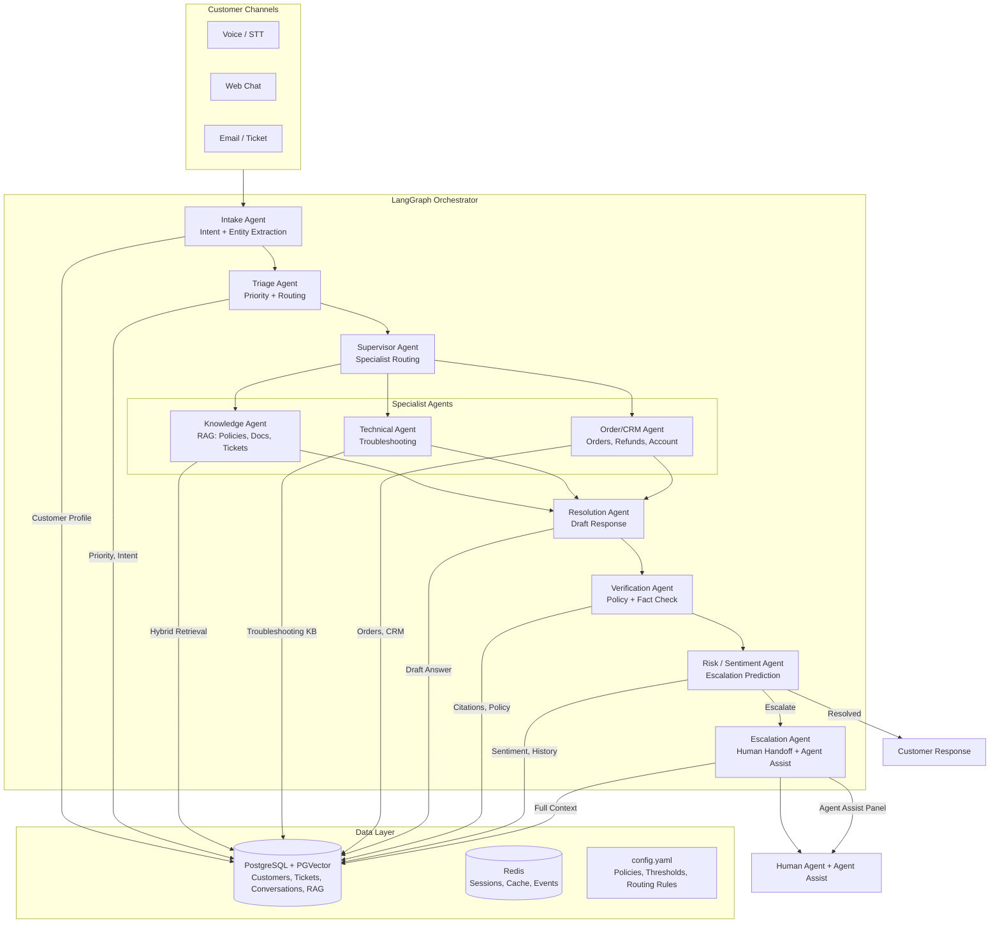
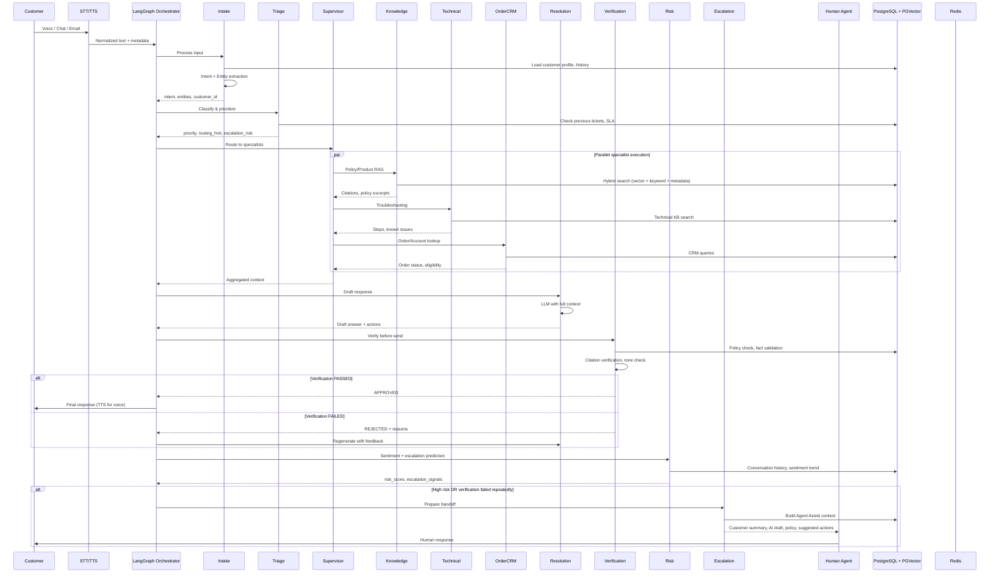
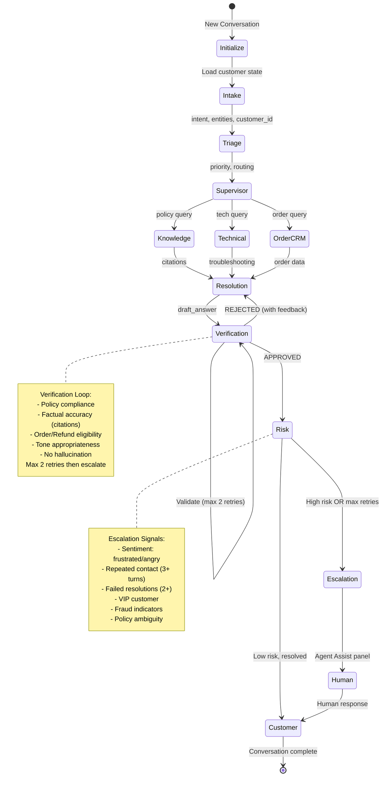

# SupportOS — Multi-Agent Customer Support Operations Platform

## Project Overview
Build a **LangGraph-orchestrated multi-agent customer support platform** that handles customer inquiries across voice, chat, and email channels. Multiple specialized agents collaborate to resolve, verify, and escalate issues while maintaining shared customer state. Includes human-in-the-loop escalation with Agent Assist panel and a manager dashboard. Demonstrates all 6 final project objectives.

---

## Architecture



---

## Agent Interaction Sequence



---

## LangGraph State Graph



---

## Shared Customer State Schema

```python
from typing import TypedDict, List, Optional, Literal
from datetime import datetime

class CustomerState(TypedDict):
    # Customer Identity
    customer_id: str
    customer_tier: Literal["standard", "premium", "vip"]
    channel: Literal["voice", "chat", "email"]
    
    # Current Conversation
    conversation_id: str
    turn_count: int
    messages: List[Message]  # role, content, timestamp, agent
    
    # Intent & Classification
    intent: str                          # e.g., "refund_request", "technical_issue"
    sub_intent: Optional[str]            # e.g., "damaged_delivery", "billing_dispute"
    entities: dict                       # order_id, product_id, account_id, etc.
    
    # Priority & Routing
    priority: Literal["low", "medium", "high", "critical"]
    routing_hint: Optional[str]          # "knowledge", "technical", "order", "billing"
    sla_deadline: Optional[datetime]
    
    # Specialist Context (populated by Supervisor)
    knowledge_citations: List[Citation]  # Policy docs, previous tickets
    technical_steps: List[str]           # Troubleshooting steps
    order_data: Optional[OrderInfo]      # Order status, eligibility, history
    
    # Resolution
    draft_answer: Optional[str]
    proposed_actions: List[Action]       # refund, replace, escalate, etc.
    verification_result: Optional[VerificationResult]
    verification_retries: int
    
    # Risk & Escalation
    sentiment: Literal["positive", "neutral", "frustrated", "angry"]
    sentiment_trajectory: List[float]    # Per-turn sentiment scores
    escalation_signals: List[str]        # Detected risk factors
    risk_score: float                    # 0.0 - 1.0
    previous_tickets: int
    failed_resolutions: int
    
    # Human Handoff
    human_escalation: bool
    escalation_reason: Optional[str]
    agent_assist_context: Optional[AgentAssistContext]
    
    # Meta
    errors: List[Error]
    checkpoints: List[Checkpoint]
    started_at: datetime
    updated_at: datetime
```

---

## Agent Specifications

### 1. Intake Agent (Intent + Entity Extraction)
- **Input**: Raw customer message + channel metadata + customer profile
- **Tasks**: Intent classification, entity extraction (order IDs, product IDs, account numbers), language detection, sentiment baseline
- **Tools**: LLM with structured output (Pydantic), spaCy for entity patterns
- **Output**: `intent`, `sub_intent`, `entities`, `language`, `initial_sentiment`

### 2. Triage Agent (Priority + Routing)
- **Input**: Intent, entities, customer profile, conversation history
- **Tasks**: Priority scoring (SLA, customer tier, issue type), routing hint, escalation risk pre-screen, SLA deadline calculation
- **Tools**: Rule engine + LLM, PostgreSQL queries for history
- **Output**: `priority`, `routing_hint`, `sla_deadline`, `escalation_risk_score`

### 3. Supervisor Agent (Specialist Routing)
- **Input**: Triage output + full context
- **Tasks**: Decide which specialists to invoke (parallel), synthesize their outputs, detect conflicts
- **Tools**: LLM with function calling, parallel sub-graph invocation
- **Output**: Aggregated specialist context, routing decisions

### 4. Knowledge Agent (Policy/Product/Historical RAG)
- **Sources**: Return/refund policies, shipping policies, warranty, pricing, product docs, internal SOPs, resolved tickets
- **Retrieval**: Hybrid (vector + BM25 + metadata filter by product/category), reranking (cross-encoder), citation extraction
- **Output**: Ranked citations with policy excerpts, confidence scores

### 5. Technical Agent (Troubleshooting)
- **Sources**: Troubleshooting guides, known issues, error code database, device diagnostics
- **Tasks**: Symptom matching, step-by-step diagnosis, known issue lookup
- **Output**: Troubleshooting steps, probable causes, escalation criteria

### 6. Order/CRM Agent (Orders, Refunds, Account)
- **Sources**: PostgreSQL (orders, customers, refunds, subscriptions), external CRM API
- **Tasks**: Order lookup, refund eligibility, warranty status, account actions (cancel, modify), subscription management
- **Tools**: SQL queries, CRM API client, business rule engine
- **Output**: Order details, eligibility flags, available actions

### 7. Resolution Agent (Draft Response)
- **Input**: Full aggregated context from all specialists
- **Tasks**: Generate customer-facing response, propose concrete actions, cite sources
- **Tools**: LLM with strict grounding instructions, action schema
- **Output**: `draft_answer`, `proposed_actions`, `citations_used`

### 8. Verification Agent (Policy + Fact Check)
- **Input**: Draft answer + proposed actions + citations
- **Tasks**: Policy compliance check, factual accuracy vs citations, order/refund eligibility validation, tone check, hallucination detection
- **Tools**: LLM-as-judge with verification prompt, rule engine for hard constraints
- **Output**: `APPROVED` / `REJECTED` with specific failure reasons

### 9. Risk / Sentiment Agent (Escalation Prediction)
- **Input**: Full conversation history, current turn, verification outcome
- **Tasks**: Per-turn sentiment analysis, trajectory tracking, escalation signal detection (repeated contact, failed resolutions, VIP, fraud)
- **Tools**: Sentiment classifier, rule-based signal detection, historical pattern matching
- **Output**: `risk_score`, `escalation_signals`, `recommendation` (resolve/escalate)

### 10. Escalation Agent (Human Handoff + Agent Assist)
- **Input**: Full customer state, verification failures, risk signals
- **Tasks**: Build Agent Assist context (summary, policy, suggested solution, customer history), create ticket, notify human agent, preserve context
- **Tools**: Ticket creation API, notification webhooks, context formatter
- **Output**: Handoff confirmation, Agent Assist payload

---

## Implementation Tasks

### Phase 1: Foundation (Week 1)
- [ ] Set up LangGraph project structure with FastAPI backend
- [ ] Define `CustomerState` TypedDict and checkpointer (PostgreSQL)
- [ ] Create base Agent class with LLM provider abstraction (OpenAI + Anthropic)
- [ ] Implement config management (Pydantic Settings + YAML)
- [ ] Set up PostgreSQL + PGVector schema (customers, tickets, conversations, kb_chunks)
- [ ] Set up Redis for sessions, caching, pub/sub events

### Phase 2: Core Agents (Week 1-2)
- [ ] Intake Agent: Intent classifier + entity extractor (structured LLM output)
- [ ] Triage Agent: Priority rules + routing logic + SLA calculator
- [ ] Supervisor Agent: Parallel specialist invocation + context synthesis
- [ ] Knowledge Agent: Hybrid RAG pipeline (PGVector + BM25 + reranker)

### Phase 3: Specialist Agents (Week 2)
- [ ] Technical Agent: Troubleshooting KB + diagnostic flow
- [ ] Order/CRM Agent: PostgreSQL queries + CRM API integration + business rules
- [ ] Resolution Agent: Grounded response generation + action proposals
- [ ] Verification Agent: Multi-check validation (policy, facts, eligibility, tone)

### Phase 4: Risk & Escalation (Week 2-3)
- [ ] Risk/Sentiment Agent: Sentiment classifier + escalation signal detector
- [ ] Escalation Agent: Agent Assist context builder + ticket creation + notifications
- [ ] Human Agent Panel API: REST endpoints for dashboard integration

### Phase 5: Channels & Voice (Week 3)
- [ ] FastAPI WebSocket endpoints for real-time chat
- [ ] STT integration (OpenAI Whisper / Deepgram) for voice
- [ ] TTS integration (OpenAI TTS / ElevenLabs) for voice responses
- [ ] Email/Ticket ingestion (IMAP / webhook)

### Phase 6: Dashboard & Observability (Week 3-4)
- [ ] Manager Dashboard (React/Next.js): Real-time metrics, ticket queue, drill-down
- [ ] Agent Assist Panel: Human agent view with AI summary, policy, suggestions
- [ ] Conversation replay & analytics
- [ ] LangSmith / OpenTelemetry tracing
- [ ] Prometheus metrics + Grafana dashboards

### Phase 7: Orchestration & Polish (Week 4)
- [ ] LangGraph workflow with conditional edges, retries, checkpoints
- [ ] Human-in-loop approval gates
- [ ] Error handling, dead letter queue, circuit breakers
- [ ] CLI & API entry points (`python -m src.main --mode api|cli|demo`)
- [ ] Unit & integration tests (pytest + pytest-asyncio)
- [ ] Demo script & presentation prep

---

## Technology Stack

| Layer | Choice |
|-------|--------|
| Orchestration | LangGraph (StateGraph) |
| Backend API | FastAPI + WebSocket |
| LLM | OpenAI GPT-4o / Claude 3.5 Sonnet (via OpenRouter) |
| Embeddings | OpenAI text-embedding-3-large / Cohere embed-multilingual |
| Reranker | Cohere Rerank / BGE-reranker |
| Vector Store | PostgreSQL + PGVector (replaces Qdrant) |
| Primary DB | PostgreSQL (customers, tickets, conversations, orders) |
| Cache/Session | Redis |
| STT | OpenAI Whisper API / Deepgram |
| TTS | OpenAI TTS / ElevenLabs |
| Frontend (Dashboard) | React + Next.js + Tailwind |
| Config | Pydantic Settings + YAML |
| Testing | pytest + pytest-asyncio + hypothesis |
| Observability | LangSmith + OpenTelemetry + Prometheus + Grafana |
| Deployment | Docker + Docker Compose |

---

## Configuration (config.yaml)

```yaml
# SupportOS Configuration

intake:
  intent_categories:
    - refund_request
    - technical_issue
    - order_inquiry
    - billing_question
    - account_change
    - product_question
    - complaint
    - cancellation
  entity_patterns:
    order_id: "ORD-\\d+"
    product_id: "PRD-\\d+"
    tracking_number: "\\b[A-Z]{2}\\d{9}[A-Z]{2}\\b"
  supported_languages: ["en", "es", "fr"]

triage:
  priority_rules:
    critical:
      - vip_customer
      - fraud_suspected
      - safety_issue
    high:
      - sentiment: angry
      - repeated_contact: 3
      - refund_over_500
    medium:
      - technical_issue
      - billing_dispute
    low:
      - product_question
      - general_inquiry
  sla_hours:
    critical: 1
    high: 4
    medium: 24
    low: 72

supervisor:
  specialist_routing:
    refund_request: ["knowledge", "order_crm"]
    technical_issue: ["technical", "knowledge"]
    order_inquiry: ["order_crm", "knowledge"]
    billing_question: ["order_crm", "knowledge"]
    product_question: ["knowledge"]
  max_parallel_specialists: 3

knowledge:
  retrieval:
    top_k: 10
    rerank_top_k: 5
    hybrid_weight: 0.6  # vector weight
    metadata_filters: ["product_category", "policy_type", "language"]
  citation_format: "[{doc_id}] {excerpt}"

technical:
  max_diagnostic_steps: 5
  known_issue_threshold: 0.8

order_crm:
  refund_eligibility_rules:
    standard_return_days: 30
    damaged_return_days: 60
    digital_products_refundable: false
  auto_approve_under: 50  # USD

resolution:
  max_response_length: 500  # tokens
  require_citations: true
  action_types:
    - refund
    - replacement
    - store_credit
    - escalate
    - information_only

verification:
  checks:
    - policy_compliance
    - factual_accuracy
    - eligibility_validation
    - tone_check
    - hallucination_detection
  max_retries: 2
  strict_mode: true

risk:
  sentiment_model: "cardiffnlp/twitter-roberta-base-sentiment-latest"
  escalation_threshold: 0.75
  signals:
    - repeated_contact: 3
    - failed_resolutions: 2
    - sentiment_deterioration: 0.3
    - vip_customer: true
    - fraud_indicators: ["multiple_accounts", "chargeback_history"]
  track_trajectory: true

escalation:
  agent_assist_sections:
    - customer_summary
    - issue_classification
    - conversation_history
    - relevant_policies
    - ai_draft_response
    - suggested_actions
    - customer_sentiment
  notification_channels: ["slack", "email", "pagerduty"]

channels:
  voice:
    stt_provider: "whisper"  # or "deepgram"
    tts_provider: "openai"   # or "elevenlabs"
    voice: "alloy"
  chat:
    websocket_enabled: true
    typing_indicator: true
  email:
    imap_enabled: true
    webhook_enabled: true

database:
  postgresql:
    host: "localhost"
    port: 5432
    database: "supportos"
    pool_size: 20
  pgvector:
    dimension: 3072
    index_type: "hnsw"
  redis:
    host: "localhost"
    port: 6379
    db: 0

observability:
  langsmith_project: "supportos"
  otel_endpoint: "http://localhost:4317"
  prometheus_port: 9090
```

---

## Testing Strategy

### Unit Tests (per agent)
- **Intake**: Intent classification accuracy on labeled dataset, entity extraction F1
- **Triage**: Priority assignment correctness, SLA calculation edge cases
- **Supervisor**: Routing decision accuracy, parallel invocation handling
- **Knowledge**: Retrieval precision@K, citation relevance, reranker improvement
- **Technical**: Diagnostic flow coverage, known issue detection
- **Order/CRM**: Eligibility rule correctness, SQL injection prevention
- **Resolution**: Grounding adherence (citation coverage), action validity
- **Verification**: False positive/negative rates per check type
- **Risk**: Sentiment classification accuracy, escalation prediction AUC
- **Escalation**: Agent Assist context completeness, ticket creation

### Integration Tests
- Full conversation flow: Voice → STT → Agents → TTS → Customer
- Multi-turn conversation with state persistence
- Verification loop: rejection → regeneration → approval
- Escalation path: Risk trigger → Agent Assist → Human response
- Channel switching: Chat → Email continuation
- Checkpoint/resume after agent failure
- Concurrent conversations (load test)

### Evaluation Metrics
- **Resolution Rate**: % conversations resolved without human escalation
- **First Contact Resolution**: % resolved in single interaction
- **Avg Resolution Time**: Target < 5 min (AI), < 15 min (with human)
- **Customer Satisfaction (CSAT)**: Post-interaction survey
- **Escalation Accuracy**: Precision/recall of escalation predictions
- **Verification Effectiveness**: % hallucinations caught, % false rejections
- **RAG Quality**: Citation precision, answer faithfulness (LLM-as-judge)
- **End-to-End Latency**: P50/P95 per channel

---

## Deliverables for Final Project

1. **Working System** — Runnable via:
   - `python -m src.main --mode api` (FastAPI server)
   - `python -m src.main --mode cli --customer-id C10291` (Interactive CLI)
   - `python -m src.main --mode demo --scenario refund_damaged` (Scripted demo)

2. **Architecture Doc** — `docs/architecture.md` with Mermaid diagrams

3. **API Reference** — `docs/api.md` (OpenAPI spec for FastAPI endpoints)

4. **Demo Video Script** — `docs/demo_script.md` (5-min walkthrough covering):
   - Voice interaction with damaged delivery refund
   - Agent Assist panel during escalation
   - Manager dashboard metrics

5. **Test Report** — `docs/evaluation.md` with metrics tables

6. **Presentation Slides** — `docs/presentation.pdf`

---

## Risks & Mitigations

| Risk | Mitigation |
|------|------------|
| LLM hallucination in customer-facing responses | Verification Agent with multi-check, citation enforcement, max 2 retries |
| Escalation prediction false positives/negatives | Tunable thresholds, human feedback loop, A/B testing |
| Voice latency (STT + LLM + TTS) | Streaming STT/TTS, response caching, async processing |
| RAG retrieval quality on policies | Hybrid search + reranker, metadata filtering, citation verification |
| State explosion in long conversations | Turn summarization, sliding window, periodic checkpoint compaction |
| Human agent adoption of Agent Assist | UX testing, keyboard shortcuts, one-click actions |
| Multi-channel context sync | Single conversation_id across channels, Redis session sync |

---

## Out of Scope (for this project)
- Multi-tenant / white-label support
- Advanced workforce management (scheduling, forecasting)
- CRM replacement (integrates with existing)
- Model fine-tuning (prompt engineering only)
- Mobile app (web-responsive dashboard only)
- Real-time translation (single language per conversation)

---

## Current Codebase Reuse

From existing `src/`:
- **ProcessController** → Reuse for PDF policy document ingestion (Knowledge Agent KB build)
- **OpenAIEmbeddingProvider** → Reuse for PGVector embeddings
- **OpenAIGenerationProvider** → Extend for structured output + multi-model support
- **MongoDB** → Replace with PostgreSQL (schema provided), but keep chat history pattern
- **Qdrant** → Replace with PGVector (simpler stack, single DB)

### Migration Notes
- `mongo_store/mongo_db.py` → `pg_store/pg_db.py` with PGVector
- `Vector_store/v_db.py` → Remove (PGVector handles vectors)
- `ProcessController.process_text()` → Use for initial KB ingestion script
- `main.py` → Replace with new FastAPI + LangGraph entry point